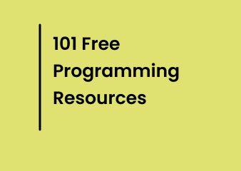

# 101-programming-resources 💡

Get 101 completely free programming resources that could potentially enhance your coding skills  

## [Table of contents]()
- [Programming-resources](#programming-resources)
    - [YouTube videos](#youtube-videos)
    - [Blogs](#blogs)

## Contribute
Do you run any non-profit organizations that provide coding lessons to learners around the world ? 🚀  

Do you have a youtube channel that helps others to learn programming? 💥  

Do you write blogs to support programmers around the globe? ❤️  

#### Then add them to the list by  this repository  

##### Read the contributing guidelines [here](https://github.com/Sadeedpv/101-programming-resources/blob/main/CONTRIBUTING.MD)

## Free Programming resources 

|Id| Resources| Description |
|--|----------|-------------|
|1|Freecodecamp|freeCodeCamp is a non-profit organization that consists of an interactive learning web platform. Their mission is to help people code for free.  According to freeCodeCamp, more than 40,000 graduates have landed jobs after completing at least one certification through freeCodeCamp. Graduates have found work at Apple, Google, Spotify, and other tech companies|
|2|The Odin Project|The Odin Project empowers aspiring web developers to learn together for free. Their full stack curriculum is free and supported by a passionate open source community.|
|3|Coursera| Coursera provides hundreds of courses from top companies & universities and you can audit the courses or apply for financial assistance if you don't have the financial stability.|
|4|Udemy|Even tough Udemy is not free, they do have a lots of courses which are completely available to all. You can find them [here](https://udemyfreecourses.org/)|
|5|edX|edX is an another massive open online course provider created by Harvard and MIT. |
|6|Codecademy|Codecademy is an American online interactive platform that offers free coding classes in 12 different programming languages including Python, Java, Go, JavaScript, Ruby, SQL, C++, C#, Swift, and Sass, as well as markup languages HTML and CSS|
|7|Udacity|Udacity offers free computer science courses taught by industry experts. Udacity offers two kinds of courses -- regular courses and nanodegrees. Regular courses are free. Regular courses with one-on-one tutoring/code review requires a monthly fee. Nanodegrees are typically for people with some prior coding experience, and cost more money.|
|8|Khan Academy| They offer multi-hour, self-paced courses in JavaScript, HTML/CSS, and SQL|
|9|YouTube | YouTube might be the one of the addictive applications you might have used in you life. But, note that it is also the best way to get into programming in 2022 if used cautiously.|
|10|MIT OpenCourseWare |MIT OpenCourseWare is a web based publication of virtually all MIT course content.|
|11|Code.org| Their motto is "Learn computer science.Change the world."|
|12|Scratch|Scratch is a high-level block-based visual programming language and website aimed primarily at children as an educational tool for programming, with a target audience of ages 8 to 16.|
|13|StackOverflow|This one doesn't need much introduction. StackOverflow is a Platform where you could ask programming related questions. |
|14|Leetcode| LeetCode is the best platform to help you enhance your skills, expand your knowledge and prepare for technical interviews.|
|15|HackerRank|HackerRank is the market-leading technical assessment and remote interview solution for hiring developers.|
|16|CodeChef|Code-Chef is an online educational program and competitive programming community of global programmers.|
|17|HackerEarth|Helps more than 3 Million developers to be better at programming through coding contests, data science competitions, and hackathons. |
|18|CS50: Introduction to Computer Science |An entry-level course taught by David J. Malan, CS50x teaches students how to think algorithmically and solve problems efficiently. Topics include abstraction, algorithms, data structures, encapsulation, resource management, security, software engineering, and web development. Languages include C, Python, SQL, and JavaScript plus CSS and HTML. Problem sets inspired by real-world domains of biology, cryptography, finance, forensics, and gaming. The on-campus version of CS50x , CS50, is Harvard's largest course. |
|19|CodinGame|Site that helps you work on problem solving skills and learn programming basics through a turn-based game.|
|20|CSS Diner|In CSS Diner, you can practice the basics of CSS through a series of 32 challenges. This is a good way to get more familiar with the language and have fun learning it.|
|21|CodeCombat|CodeCombat works well for both kids and adult learners. You can create a free account and learn the fundamentals of programming like loops, functions, conditionals, and  variables.|
|22|Tynker|Tynker is a site where you can build projects and play games using HTML, CSS, JavaScript, Python, and Java. They have an extensive list of projects, algorithms and data structure challenges.|
|23|SQL Murder Mystery|SQL Murder Mystery is great for both beginners and experienced SQL developers. Strengthen your SQL and problem solving skills by trying to track down the killer in this murder mystery.The game uses SQLite and you will first have to get acquainted with the database structure before starting the game.|
|24|Untrusted|Untrusted is an adventure game where you can test your JavaScript and problem solving skills.|
|25|CheckiO|CheckiO is a strategy game where you can learn TypeScript or Python through a series of challenges.|
|26|W3Schools|W3Schools is a freemium educational website for learning coding online with real time examples.|
|27|GeeksforGeeks|A Computer Science portal for geeks. It contains well written, well thought and well explained computer science and programming articles and is a platform to practice programming problems.|
|28|tutsplus|Discover free how-to tutorials and video courses with tutsplus. Build an app, create a website, or learn a new skill.|
|29|Sololearn|Get access to courses designed by experts with real-world practice.|
|30|developer.mozilla.org|MDN Web Docs, previously Mozilla Developer Network and formerly Mozilla Developer Center, is a documentation repository and learning resource for web developers. It was started by Mozilla in 2005 as a unified place for documentation about open web standards, Mozilla's own projects, and developer guides.|
|31|javascript|As the name suggests, it's a free guide for programmers who wish to learn Javascript |
|32|Studytonight.com|Best place to learn Engineering subjects like Core Java, C++, DBMS, Data Structures etc through Hand-written simple Tutorial, Tests and Video tutorials.|
|33|programiz|Learn to code in Python, C/C++, Java, and other popular programming languages with their easy to follow tutorials, examples, online compiler and references.|
|34|Ruby warrior|If you want to learn Ruby, then Ruby Warrior is the game for you. There are beginner and intermediate tracks to suit your skill level. The lessons start out easy and go from there.|
|35|Github| Yes, you heard that right! Github is the best place to start your coding journey. You can read hundreds of source code written by other programmers in Github. You can also find lots of challenges and resources to empower your coding skills. |
|36|Codepen|CodePen is an online community for testing and showcasing user-created HTML, CSS and JavaScript code snippets. It functions as an online code editor and open-source learning environment, where developers can create code snippets, called "pens," and test them.|
|37|Swift Playgrounds|Swift is a programming language created by Apple and used by professionals to build apps for use on Apple devices. With the Swift Playgrounds app, students are able to learn Swift through an engaging and fun set of challenges.|
|38|Google|If you haven't already, you've probably heard a developer jokingly refer to themselves as a professional Googler. While exaggerated, the saying holds a tidbit of truth. Google is a valuable resource for programmers, and many coding problems can be solved with a simple search.|
|39|Simplilearn|Simplilearn is the popular online Bootcamp & online courses learning platform.|
|40|SQLZoo|SQLZoo is the go-to online resource for learning everything SQL. From SQLZoo, you can learn about SQL server, Oracle, MySQL, DB2, and PostgresSQL. Learn from various interactive tutorials and reference pieces and test your new skills with assessments.|
|41|Code School|If you’re not exactly sure where to start, Code School offers different paths that you can follow to build specific skills. If you’re ready to just dive right in, you can also select courses from the full library and most of the basic level courses are 100% free.|
|42|Code Avengers|If you want to learn how to build a website, apps, or games, Code Avengers is the site for you. Code Avengers has over 100 hours of courses teaching you how to build websites in HTML & CSS and games or apps in JavaScript.|
|43|Project Euler| Project Euler is a website dedicated to a series of computational problems intended to be solved with computer programs. The project attracts graduates and students interested in mathematics and computer programmings.|
|44|Django girls|Django Girls is an international non-profit organization created to inspire women from all backgrounds to get interested in technology and to become programmers, offering a safe and friendly environment.|
|45|MotherCoders|MotherCoders is a nonprofit organization whose mission is to help women with kids on-ramp to careers in tech so they can thrive in a digital economy.|
|46|Girls Who Code |Girls Who Code is a nonprofit organization which aims to support and increase the number of women in computer science by equipping young women with the necessary computing skills to pursue 21st-century opportunities.|
|47|Pyladies|PyLadies is an international mentorship group which focuses on helping more women become active participants in the Python open-source community.|
|48|Railsgirls|They are aiming to give tools and a community for women to understand technology and to build their ideas|
|49|CodeNewbie|One of the most supportive community of programmers.|
|50|MIT App Inventor|MIT App Inventor is a visual programming environment that allows all ages of learners to build fully functional apps for Android and iOS smartphones and tablets.|
|51|codegrepper.com| It is the ultimate query and answer system for programmers.|

### YouTube Channels 
|Id| Channel Name| Description |
|--|----------|-------------|
|1|[freeCodeCamp](https://www.youtube.com/c/Freecodecamp/featured)|Their videos are long-form, in-depth content about various programming languages with playlists for beginners and experts. Their videos ranging from three hours to a few minutes cover traditional and modern technologies like HTML, JavaScript, PHP, CSS, ML, data science and Python. Their YouTube channel is very popular with over 5 million students and several playlists.|
|2|[programming-with-mosh](https://www.youtube.com/c/programmingwithmosh/featured)|Mosh Hamedani aims to train coders and software engineers to be the talent companies want to hire.|
|3|[Traversy-Media](https://www.youtube.com/c/TraversyMedia/featured)|The channel created by Brad Traversy covers programming technologies like HTML, CSS and JavaScript, frontend frameworks like React and Vue, and backend concepts such as Node.js, Python and PHP.|
|4|[fireship.io](https://www.youtube.com/c/fireship/featured)|Are you exhausted of watching 6 hour tutorial videos on YouTube? Then this channel is for you. He explains the most complex programming concepts in 5 minutes.|
|5|[Kevin-Powell](https://www.youtube.com/c/kevin-powell/featured)|Do you hate CSS? Then this guy will definitely make you fall in love with CSS!|
|6|[Web-dev-simplified](https://www.youtube.com/c/WebDevSimplified/features)|As the name suggests, this channel aims to simplify web development. |
|7|[Dev-ed](https://www.youtube.com/c/deved/featured)|Want to learn cool javascript animations? Then, you are looking at the right place!|
|8|[The-Net-Ninja](https://www.youtube.com/c/TheNetNinja/featured)|The Net Ninja is one of the best YouTube channels to learn more about web development and programming.|
|9|[Treehouse](https://www.youtube.com/c/gotreehouse/featured)|Team Treehouse is an online learning platform catered towards beginners enthusiastic about building a career in coding. |
|10|[Dev-Tips](https://www.youtube.com/c/DevTipsForDesigners/featured)|DevTips is a weekly show for web designers and coders with over 200 videos on CSS, HTML, Docker, Kubernetes, GitHub and more.|
|11|[DesignCourse.com](https://www.youtube.com/c/designcourse/featured)|For a developer, it's important to have basic knowledge on design concepts. This channel helps you to improve you design skills.|
|12|[Code-with-Ania-Kubow](https://www.youtube.com/aniakubow/featured)|Do you love games? Her videos help you to develop more games by following step by step tutorials (javascript)|
|13|[TheNewBoston](https://www.youtube.com/user/thenewboston/featured)|Their videos cover a range of topics from modern blockchain, docker and discord to SEO, Python, Node.js and Gulp.js. Bucky Roberts is an IT graduate and teaches the lessons easy to understand, making the channel a perfect resource for beginner programmers. |
|14|[Online-tutorials](https://www.youtube.com/c/OnlineTutorials4Designers/featured)|This channel helps you to dive deep into awesome css animations.|
|15|[Florin-Pop](https://www.youtube.com/c/Florinpop/featured)| He'll teach you a lot about web development(HTML,CSS, Javascript, Reactjs, Nodejs, APIs and all other cool stuffs 😎)|
|16|[ProgramWithErik](https://www.youtube.com/c/programwitherik/featured)|If you want coding tutorials and advices, then visit this channel|
|17|[CSDojo](https://www.youtube.com/c/CSDojo/featured)|He helps to your crack DSA(Data structure and Algorithm) problems & questions and ace the coding interviews.|
|18| [CleverProgrammer](https://www.youtube.com/c/CleverProgrammer/featured) | Want to build real-world projects and earn more depth in your skills? Then, click on the link right now!|
|19| [JavascriptMastery](https://www.youtube.com/c/JavaScriptMastery) | Launch your development career with project-based coaching - showcase your skills with practical development experience and land the coding career of your dreams |
|20| [codedamn](https://www.youtube.com/c/codedamn) | Helps you to enhance your programming skills|
|21| [codewithharry](https://www.youtube.com/c/CodeWithHarry) | There are lot of coding tutorials and development advices are there.|

### Must Follow blogs 

|Id| Blogs|
|--|----------|
|1|[Dev.to](https://dev.to/)|
|2|[CSS-tricks](https://css-tricks.com/)|
|3|[Medium](https://medium.com/)|
|4|[freeCodeCamp](https://www.freecodecamp.org/news/tag/blog/)|
|5|[StackOverflow.blog](https://stackoverflow.blog/)|
|6|[RealPython](https://realpython.com/)|
|7|[codinghorror](https://blog.codinghorror.com/)|
|8|[webdesignerdepot](https://www.webdesignerdepot.com/)|
|9|[hackernoon](https://hackernoon.com/)|
|10|[Sololearn](https://www.sololearn.com/blog)|
|11|[W3Schools](https://www.w3schools.com/)|

## LICENSE

  
#### The project is licensed under MIT 

## Conclusion

#### At the end of the day, it doesn't matter how many resources you have. It's all about understanding the concepts and learning from your mistakes  
If you enjoyed the repo, don't hesitate to give it a star 🌟 
Share it to your friends and together we can make the community grow better ☕ 

